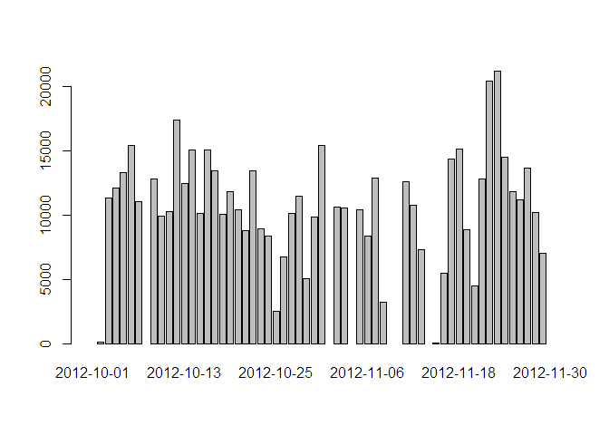
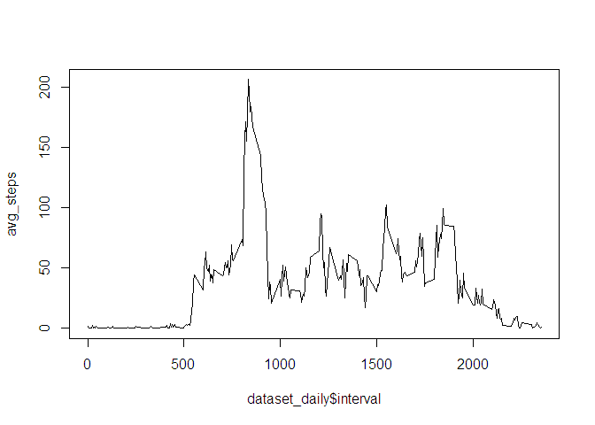
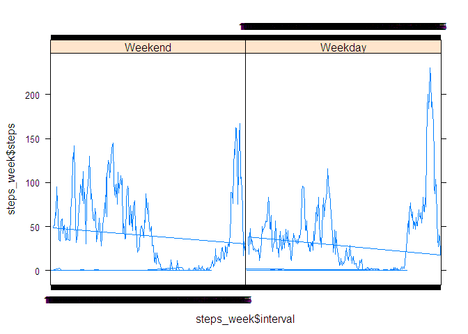

# Reproducible Research: Peer Assessment 1


## Loading and preprocessing the data

```r
data<-read.csv("C:/Documents and Settings/Samarth/RepData_PeerAssessment1/activity.csv")
dataset<-data[!is.na(data$steps),]
```


```r
barplot(tapply(dataset$steps,dataset$date,sum))
```

 

## What is mean total number of steps taken per day?

```r
means<-tapply(dataset$steps,dataset$date,sum)
means<-means[!is.na(means)]
mean<-mean(means)
mean
```

```
## [1] 10766
```

## What is median total number of steps taken per day?

```r
medians<-tapply(dataset$steps,dataset$date,sum)
medians<-medians[!is.na(medians)]
median<-median(medians)
median
```

```
## [1] 10765
```

## What is the average daily activity pattern?

```r
dataset_daily<-data[!duplicated(data$interval),]
avg_steps=tapply(dataset$steps,dataset$interval,mean)
plot(dataset_daily$interval,avg_steps,type='l')
```

 

## The 5 min interval containing, on avg, the maximum number of steps is:

```r
names(avg_steps[which.max(avg_steps)])
```

```
## [1] "835"
```

## Inputing missing values
### The total number of missing values are

```r
sum(is.na(data$steps))
```

```
## [1] 2304
```

## Filled in missing values with mean for that 5 min interval

```r
avg_steps_frame<-data.frame(interval=names(avg_steps),avg_steps)
dataset_input<-data
for(i in 1:17568)
{
    if(is.na(dataset_input[i,1]))
        dataset_input[i,1]<-avg_steps_frame[avg_steps_frame$interval==dataset_input[i,3],2]
}
```

## The new data set is dataset_input

```r
head(dataset_input)
```

```
##     steps       date interval
## 1 1.71698 2012-10-01        0
## 2 0.33962 2012-10-01        5
## 3 0.13208 2012-10-01       10
## 4 0.15094 2012-10-01       15
## 5 0.07547 2012-10-01       20
## 6 2.09434 2012-10-01       25
```

## Histogram Plot and Mean, Median

```r
barplot(tapply(dataset_input$steps,dataset_input$date,sum))
```

 

```r
means_i<-tapply(dataset_input$steps,dataset_input$date,sum)
means_i<-means_i[!is.na(means_i)]
mean_i<-mean(means_i)
mean_i
```

```
## [1] 10766
```

```r
medians_i<-tapply(dataset_input$steps,dataset_input$date,sum)
medians_i<-medians_i[!is.na(medians_i)]
median_i<-median(medians_i)
median_i
```

```
## [1] 10766
```

We Observe that the mean remains the same. However, the median increases a little.

## Are there differences in activity patterns between weekdays and weekends?

```r
library(lattice)
day<-character(0)
for(i in 1:17568)
{
    date<-dataset_input[i,2]
    weekday<-weekdays(as.Date(date))
    
    if(weekday=="Saturday" || weekday=="Sunday")
        day<-rbind(day,"Weekend")
    
    else
        day<-rbind(day,"Weekday")    
}
dataset_weeks<-cbind(dataset_input,day)

wd<-data.frame(steps=numeric(0),data=character(0),interval=numeric(0), day=character(0))
we<-data.frame(steps=numeric(0),data=character(0),interval=numeric(0), day=character(0))

for(i in 1:17568)
{
    if(dataset_weeks[i,4]=="Weekday")
        wd<-rbind(wd,dataset_weeks[i,])
    
    else
        we<-rbind(we,dataset_weeks[i,])
}

avg_steps_wd=tapply(wd$steps,wd$interval,mean)
avg_steps_we=tapply(we$steps,we$interval,mean)

steps_wd<-data.frame(steps=avg_steps_wd,interval=names(avg_steps_wd))
steps_we<-data.frame(steps=avg_steps_we,interval=names(avg_steps_we))

steps_wd<-cbind(steps_wd,day="Weekday")
steps_we<-cbind(steps_we,day="Weekend")
steps_week<-rbind(steps_we,steps_wd)

xyplot(steps_week$steps~steps_week$interval|steps_week$day,type='l')
```

 
